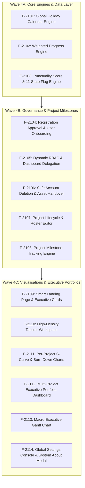
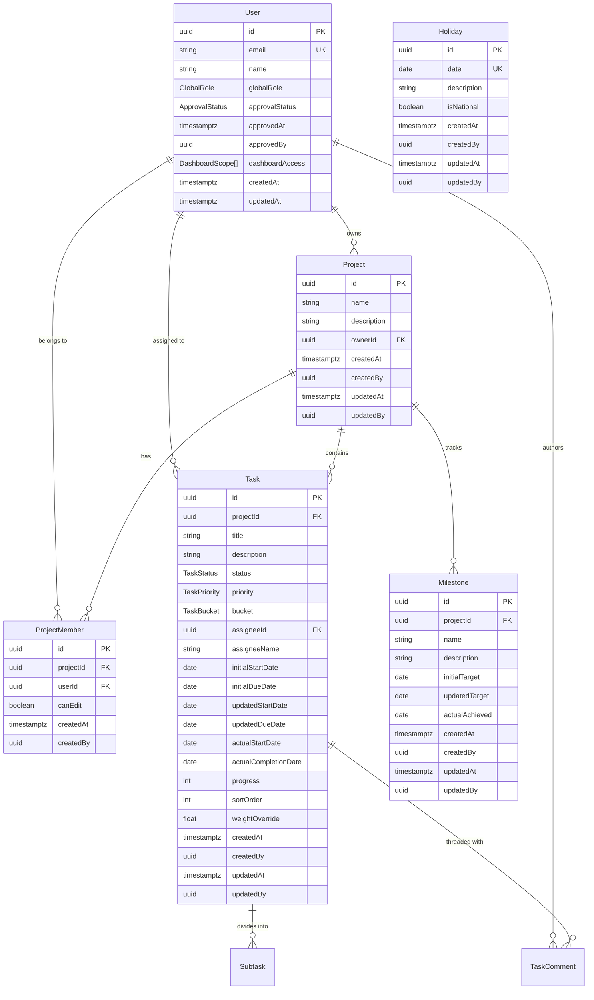
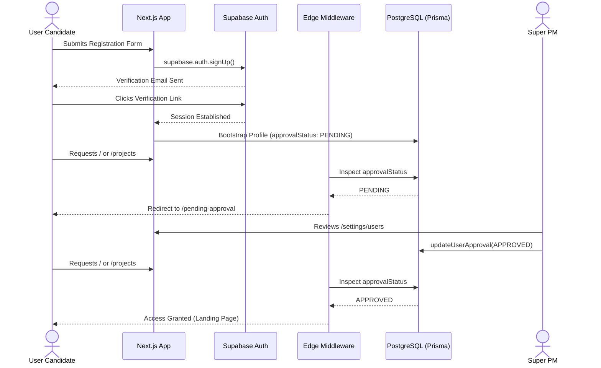
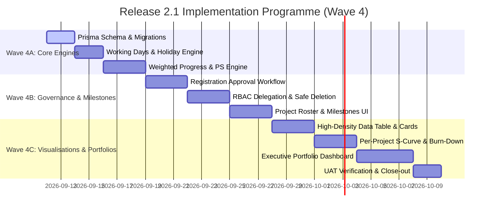

# Simple Project Task Tracker 2.1 — Master Development Plan (North Star Blueprint)

**Document Identifier:** `doc/dev_plan.md`  
**Product Title:** Simple Project Task Tracker 2.1 (Executive Portfolio Intelligence System)  
**Version:** 2.1.0  
**Status:** Canonical Master Plan (North Star) — Approved for Release 2.1 Implementation  
**Target Platform:** Next.js 16 (App Router), React 19, TypeScript, Tailwind CSS v4, Supabase PostgreSQL, Prisma ORM 7  
**IDE Target:** Antigravity Standalone Environment  
**Language Standard:** Professional Australian English (`en-AU`)  
**Companion Specifications:**
* [`./doc/dev_req.md`](./dev_req.md) — Detailed System Requirements Specification (Release 2.1)
* [`./doc/dev_ref.md`](./dev_ref.md) — Raw Refinement Requirements Blueprint
* [`./doc/dev_spec.md`](./dev_spec.md) — Technical Specification Baseline (Wave 3 Close-out)
* [`./doc/dev_proc.md`](./dev_proc.md) — Historical Engineering Journal & Execution Log
* [`./doc/supabase-security.md`](./supabase-security.md) — Row-Level Security (RLS) Baseline

---

## 1. Project Overview

Simple Project Task Tracker 2.1 is an **Executive Portfolio Intelligence System** designed for capital programme governance, multi-project delivery leadership, and high-velocity engineering teams. In complex enterprise delivery, unweighted task counts and subjective progress percentages routinely obscure critical schedule slippage—a dozen rapid administrative completions cannot compensate for a four-week delay on an architectural dependency. 

Version 2.1 addresses this fundamental challenge by transitioning from an operational task tracker into an executive intelligence platform. It introduces a mathematically rigorous **Weighted Progress Engine** based on business working days (excluding statutory Australian holidays and corporate shutdowns), an **Uncapped Target Progress & Punctuality Score (PS) Engine** for early schedule risk detection, a deterministic **11-State Status Flag Matrix**, cumulative **S-Curve & Burn-Down Visualisations**, and a multi-tiered **Executive Portfolio Dashboard** with macro Gantt roadmaps. 

Primary stakeholders comprise:
* **Super PMs (Platform Administrators & Portfolio Directors):** Requiring portfolio-wide aggregation, registration governance, holiday scheduling, and safe resource reallocation.
* **Project Managers (PMs / Delivery Leads):** Requiring milestone control, roster management, accurate S-Curve schedule tracking, and automated delay detection.
* **Team Members (Specialist Contributors):** Requiring high-density tabular workspaces with inline editing and transparent personal workload clarity.
* **Viewers (Executive Sponsors & External Auditors):** Requiring read-only access to macro milestones, portfolio health indicators, and audited progress trails.

---

## 2. Feature List (Version 2.1 Scope)

The scope for Version 2.1 is catalogued below into discrete, testable, and demonstrable feature units. Each feature is assigned a unique identifier to facilitate sprint planning, traceable implementation, and acceptance verification.



### F-2101: Global Holiday Calendar & Working Days Engine
* **Scope:** Dedicated CRUD management interface under `/settings/holidays` restricted to Super PMs.
* **Capability:** Captures statutory Australian public holidays and corporate shutdown dates (`@db.Date`).
* **Calculation Impact:** Underpins all scheduling arithmetic, defining working days strictly as Monday–Friday excluding registered holidays. Dynamically recalculates dependent task durations, relative weights, and target progress trajectories.

### F-2102: Mathematically Rigorous Weighted Progress Engine
* **Scope:** Task-level and project-level progress computation engine (`src/lib/analytics/weighted-progress.ts`).
* **Capability:** Computes relative task weight $W_i$ based on planned working-day duration relative to aggregate project working days:
  $$W_i = \frac{D_{\text{planned}_i}}{\sum_{k=1}^{n} D_{\text{planned}_k}}$$
* **Symmetrical Summation:** Project progress is derived via the direct linear sum of weighted tasks ($P_{\text{actual}_{\text{project}}} = \sum W_i \times P_{\text{actual}_i}$; $P_{\text{target}_{\text{project}}} = \sum W_i \times P_{\text{target}_i}$), guaranteeing $100.0\%$ mathematical normalisation with zero secondary re-weighting distortion.

### F-2103: Punctuality Score (PS) & 11-State Status Flag Engine
* **Scope:** Schedule variance and early warning classification engine.
* **Capability:** 
  * Uncapped target progress ($P_{\text{target}} = E_{\text{elapsed}} / D_{\text{planned}}$), allowing target progress to exceed $100\%$ when tasks breach their due dates.
  * Piecewise evaluation of Punctuality Score across Not Started, In Progress, and Completed tasks, plus project-level aggregate punctuality.
  * Deterministic mapping to exactly one of **11 Australian English PM Status Flags** (Due to Commence, Delayed Commencement, Critically Overdue Start, On Track, Slipping, Critically Delayed, Ahead of Schedule, Completed Ahead of Schedule, Completed On Time, Completed Late, Completed Severely Late).

### F-2104: Registration Approval & User Onboarding Workflow
* **Scope:** Identity management and edge security boundary.
* **Capability:** Newly registered accounts automatically enter `approvalStatus = PENDING`. Next.js edge middleware redirects unapproved accounts to `/pending-approval` with informative messaging and session sign-out capabilities. Super PMs manage an approval console under `/settings/users` to review, approve, or reject candidate accounts.

### F-2105: Dynamic RBAC Governance & Dashboard Delegation
* **Scope:** Granular authorization engine (`src/lib/rbac.ts`).
* **Capability:** Super PMs can arbitrarily delegate or revoke executive dashboard access per user across three distinct scopes: `PROJECT` (Per-Project Analytics), `PM_PORTFOLIO` (PM Portfolio Analytics), and `TOTAL_COMPANY` (Macro Enterprise Portfolio). Project visibility and write rights are strictly governed via indexed relational `ProjectMember` join records.

### F-2106: Safe Account Deletion & Asset Handover Protocol
* **Scope:** Database integrity and administrative user management.
* **Capability:** Direct cascading deletion of user accounts is blocked. When a Super PM initiates user deletion, an integrity scanner checks for owned projects and assigned tasks. If dependencies exist, a **Safe Handover Modal** mandates the atomic reassignment of all projects and tasks to a nominated replacement user before the user record is purged.

### F-2107: Project Lifecycle & Dynamic Roster Editor
* **Scope:** Project administration modal accessible to owning PMs and Super PMs.
* **Capability:** Inline updating of project metadata (Name, Description) and dynamic team roster composition (adding, editing permissions, or removing `ProjectMember` records).

### F-2108: Project Milestone Tracking Engine
* **Scope:** High-level contractual deliverable and stage-gate tracking.
* **Capability:** CRUD interface for project milestones, capturing `initialTarget`, `updatedTarget`, and `actualAchieved` dates. Automatic initial synchronisation (`updatedTarget = initialTarget`). Visual integration as vertical stage-gate markers on project Gantt charts and diamond nodes on executive macro bars.

### F-2109: Smart Landing Page Views & Enhanced Project Cards
* **Scope:** Primary application entry point (`app/page.tsx`).
* **Capability:**
  * Role-aware smart defaults: Super PMs and PMs land on "My Own Projects"; Team Members land on "My Assigned Projects". Quick-filter tabs allow instant switching to "All Projects" or "Projects by PM".
  * Enhanced project cards displaying designated PM identity, real-time Status Flag pill badges, task counts, and compact dual progress bars ($P_{\text{target}}$ vs. $P_{\text{actual}}$).

### F-2110: High-Density Tabular Workspace
* **Scope:** Workspace data presentation layer (`TaskListView.tsx`).
* **Capability:** High-density enterprise data grid presenting task order, title, process group, priority, relative weight ($W_i$), multi-dates (initial, updated, actual), PIC badge, status, and progress. Supports inline cell editing for rapid status, priority, and progress updates without opening the task drawer.

### F-2111: Per-Project S-Curve & Effort Burn-Down Visualisations
* **Scope:** Analytical engine inside `ProjectAnalyticsView.tsx`.
* **Capability:**
  * **S-Curve:** Renders cumulative planned baseline ($P_{\text{target}}(t)$) versus cumulative actual achievement ($P_{\text{actual}}(t)$) over the project calendar duration.
  * **Burn-Down:** Visualises remaining working-day effort over time against an ideal linear burn-down trajectory.
  * **Dashboard Header:** Integrates aggregate Punctuality Score ($\text{Project PS}$), Target vs. Actual progress divergence ($\Delta P$), and overall project Status Flag.

### F-2112: Multi-Project Executive Portfolio Dashboard
* **Scope:** Dedicated enterprise routing under `/portfolio`.
* **Capability:** Provides three analytical scopes accessible based on user privileges:
  1. *Analytics by Project:* Comparative deep-dive across selected projects.
  2. *Analytics by PM:* Aggregated portfolio performance and resource allocation under a designated PM.
  3. *Total Company Projects:* Macro enterprise capital investment overview across all active corporate programmes.

### F-2113: Macro Executive Gantt Chart
* **Scope:** Top-level visual timeline on `/portfolio`.
* **Capability:** Three uncluttered horizontal timeline bars per project: Initial Planned Span (zinc), Updated Planned Span (sky), and Actual Realisation Span (emerald/amber). Milestone diamond nodes overlaid directly on the bars with instant 0ms hover tooltips detailing milestone achievements and variances.

### F-2114: Global Settings Console & System About Modal
* **Scope:** Platform administration and governance console.
* **Capability:** Centralised administrative navigation under `/settings` (User Approvals, Privilege Matrix, Safe Deletion, Holiday Calendar). System About modal displaying version `v2.1.0-executive-intel`, runtime stack details, and formal architectural credits recognising **Yugo Ananda** as the Grand Designer and Chief Solution Architect.

---

## 3. Data Models & Entity Relationships

All database primary keys are PostgreSQL **UUID** strings. Calendar dates are stored as `@db.Date` without time components. Timestamps are stored as `timestamptz`. Every operational entity incorporates a standardised **Audit Trail** (`createdAt`, `createdBy`, `updatedAt`, `updatedBy`).



### 3.1 Enumerations
```typescript
type GlobalRole = "super_pm" | "pm" | "member" | "viewer";
type ApprovalStatus = "PENDING" | "APPROVED" | "REJECTED";
type DashboardScope = "PROJECT" | "PM_PORTFOLIO" | "TOTAL_COMPANY";
type TaskStatus = "todo" | "in_progress" | "done";
type TaskPriority = "urgent" | "important" | "medium" | "low";
type TaskBucket = "initiating" | "planning" | "executing" | "monitoring" | "closing";
```

### 3.2 Canonical Prisma Models (`prisma/schema.prisma`)
```prisma
model Holiday {
  id          String   @id @default(uuid()) @db.Uuid
  date        DateTime @unique @db.Date
  description String
  isNational  Boolean  @default(true)
  
  createdAt   DateTime @default(now())
  createdBy   String?  @db.Uuid
  updatedAt   DateTime @updatedAt
  updatedBy   String?  @db.Uuid

  @@index([date])
}

model User {
  id              String           @id @db.Uuid
  email           String           @unique
  name            String
  globalRole      GlobalRole       @default(member)
  approvalStatus  ApprovalStatus   @default(PENDING)
  approvedAt      DateTime?
  approvedBy      String?          @db.Uuid
  dashboardAccess DashboardScope[] @default([PROJECT, PM_PORTFOLIO])
  
  createdAt       DateTime         @default(now())
  updatedAt       DateTime         @updatedAt

  ownedProjects   Project[]        @relation("ProjectOwner")
  projectMembers  ProjectMember[]
  assignedTasks   Task[]           @relation("TaskAssignee")
  comments        TaskComment[]

  @@index([email])
  @@index([approvalStatus])
}

model Project {
  id          String   @id @default(uuid()) @db.Uuid
  name        String
  description String   @default("")
  ownerId     String   @db.Uuid
  
  createdAt   DateTime @default(now())
  createdBy   String?  @db.Uuid
  updatedAt   DateTime @updatedAt
  updatedBy   String?  @db.Uuid

  owner       User            @relation("ProjectOwner", fields: [ownerId], references: [id])
  members     ProjectMember[]
  tasks       Task[]
  milestones  Milestone[]

  @@index([ownerId])
}

model ProjectMember {
  id        String   @id @default(uuid()) @db.Uuid
  projectId String   @db.Uuid
  userId    String   @db.Uuid
  canEdit   Boolean  @default(true)
  
  createdAt DateTime @default(now())
  createdBy String?  @db.Uuid

  project   Project  @relation(fields: [projectId], references: [id], onDelete: Cascade)
  user      User     @relation(fields: [userId], references: [id], onDelete: Cascade)

  @@unique([projectId, userId])
  @@index([userId])
  @@index([projectId])
}

model Milestone {
  id             String    @id @default(uuid()) @db.Uuid
  projectId      String    @db.Uuid
  name           String
  description    String?   @default("")
  initialTarget  DateTime  @db.Date
  updatedTarget  DateTime  @db.Date
  actualAchieved DateTime? @db.Date

  createdAt      DateTime  @default(now())
  createdBy      String?   @db.Uuid
  updatedAt      DateTime  @updatedAt
  updatedBy      String?   @db.Uuid

  project        Project   @relation(fields: [projectId], references: [id], onDelete: Cascade)

  @@index([projectId])
  @@index([updatedTarget])
}

model Task {
  id                   String       @id @default(uuid()) @db.Uuid
  projectId            String       @db.Uuid
  title                String
  description          String       @default("")
  status               TaskStatus   @default(todo)
  priority             TaskPriority @default(medium)
  bucket               TaskBucket   @default(executing)
  assigneeId           String?      @db.Uuid
  assigneeName         String       @default("")
  
  initialStartDate     DateTime?    @db.Date
  initialDueDate       DateTime?    @db.Date
  updatedStartDate     DateTime?    @db.Date
  updatedDueDate       DateTime?    @db.Date
  actualStartDate      DateTime?    @db.Date
  actualCompletionDate DateTime?    @db.Date
  
  progress             Int          @default(0)
  sortOrder            Int          @default(0)
  weightOverride       Float?

  createdAt            DateTime     @default(now())
  createdBy            String?      @db.Uuid
  updatedAt            DateTime     @updatedAt
  updatedBy            String?      @db.Uuid

  project              Project       @relation(fields: [projectId], references: [id], onDelete: Cascade)
  assignee             User?         @relation("TaskAssignee", fields: [assigneeId], references: [id], onDelete: SetNull)
  subtasks             Subtask[]
  comments             TaskComment[]

  @@index([projectId])
  @@index([projectId, status, sortOrder])
}
```

---

## 4. API Surface & Server Action Contracts

All server mutations and data queries execute exclusively through **Next.js Server Actions** (`"use server"`). No direct client-side database connections or browser Supabase Data API calls are permitted. Every action re-validates authentication, user approval status, and project-level authorization.

```typescript
// Shared Action Result Contract
type ActionResult<T> =
  | { success: true; data: T }
  | { success: false; error: string; code?: string };
```

### 4.1 Global Holiday Server Actions (`src/lib/actions/holidays.ts`)
* `listHolidays(): Promise<ActionResult<Holiday[]>>`
  * *Responsibility:* Fetches all registered corporate and national holidays ordered by date.
* `createHoliday(input: { date: string; description: string; isNational: boolean }): Promise<ActionResult<Holiday>>`
  * *Authorization:* Super PM only.
  * *Side Effect:* Revalidates holiday caches; triggers project duration/weight re-evaluation.
* `deleteHoliday(id: string): Promise<ActionResult<void>>`
  * *Authorization:* Super PM only.

### 4.2 User Governance & Administration Actions (`src/lib/actions/governance.ts`)
* `listUsersForApproval(): Promise<ActionResult<{ pending: User[]; approved: User[]; rejected: User[] }>>`
  * *Authorization:* Super PM only.
* `updateUserApproval(input: { userId: string; status: ApprovalStatus }): Promise<ActionResult<User>>`
  * *Authorization:* Super PM only. Records `approvedAt` and `approvedBy`.
* `updateUserPrivileges(input: { userId: string; globalRole: GlobalRole; dashboardAccess: DashboardScope[] }): Promise<ActionResult<User>>`
  * *Authorization:* Super PM only.
* `inspectUserDeletion(userId: string): Promise<ActionResult<{ ownedProjectCount: number; assignedTaskCount: number }>>`
  * *Authorization:* Super PM only. Performs dependency pre-scan before deletion.
* `safeDeleteUser(input: { targetUserId: string; replacementUserId: string }): Promise<ActionResult<void>>`
  * *Authorization:* Super PM only. Atomically reassigns all owned projects and assigned tasks to `replacementUserId` in a single database transaction, then removes the target user record and revokes Supabase auth.

### 4.3 Project Lifecycle & Milestone Actions (`src/lib/actions/projects.ts` & `milestones.ts`)
* `updateProjectDetails(input: { projectId: string; name: string; description: string }): Promise<ActionResult<Project>>`
  * *Authorization:* Project Admin (owning PM) or Super PM.
* `updateProjectRoster(input: { projectId: string; memberUserIds: string[] }): Promise<ActionResult<void>>`
  * *Authorization:* Project Admin or Super PM. Synchronises `ProjectMember` join records.
* `listMilestones(projectId: string): Promise<ActionResult<Milestone[]>>`
  * *Authorization:* Any user with read access to the project.
* `createMilestone(input: { projectId: string; name: string; description?: string; targetDate: string }): Promise<ActionResult<Milestone>>`
  * *Authorization:* Project Admin or Super PM. Automatically initializes `updatedTarget = targetDate`.
* `updateMilestone(input: { milestoneId: string; name?: string; description?: string; updatedTarget?: string; actualAchieved?: string | null }): Promise<ActionResult<Milestone>>`
  * *Authorization:* Project Admin or Super PM.
* `deleteMilestone(milestoneId: string): Promise<ActionResult<void>>`
  * *Authorization:* Project Admin or Super PM.

### 4.4 Task & Inline Grid Actions (`src/lib/actions/tasks.ts`)
* `updateTaskInline(input: { taskId: string; patch: Partial<Pick<Task, "status" | "priority" | "progress" | "assigneeId" | "assigneeName">> }): Promise<ActionResult<Task>>`
  * *Authorization:* Project Member with `canEdit: true`, Project Admin, or Super PM.
  * *Side Effect:* Synchronises bidirectional progress/status rules and recalculates punctuality flags.

### 4.5 Executive Portfolio Actions (`src/lib/actions/portfolio.ts`)
* `getPortfolioSummary(scope: DashboardScope, filterPmId?: string): Promise<ActionResult<PortfolioSummaryDto>>`
  * *Authorization:* Session user must hold the requested `DashboardScope` in their `dashboardAccess` array.
  * *Returns:* Aggregate active projects, portfolio punctuality score, portfolio weighted target vs. actual progress, status flag breakdown, and macro Gantt project span items.

---

## 5. Authentication & Authorisation Requirements

### 5.1 Simplified Registration & Approval Flow


### 5.2 Role-Based Access Control (RBAC) Matrix

| Operational Capability | Super PM | Project Manager (Owner) | Project Manager (Non-Owner) | Team Member (Assigned) | Viewer (Assigned) | Candidate (Pending) |
| :--- | :---: | :---: | :---: | :---: | :---: | :---: |
| **System Settings & Holiday Calendar** | Full Access | Denied | Denied | Denied | Denied | Denied |
| **User Approval & Privilege Override** | Full Access | Denied | Denied | Denied | Denied | Denied |
| **Safe User Deletion & Reassignment** | Full Access | Denied | Denied | Denied | Denied | Denied |
| **Create New Project** | Allowed | Allowed | Allowed | Denied | Denied | Denied |
| **Edit Project Roster & Metadata** | Allowed | Allowed | Denied | Denied | Denied | Denied |
| **Manage Project Milestones** | Allowed | Allowed | Denied | Denied | Denied | Denied |
| **Create / Edit Tasks (Kanban / Table)** | Allowed | Allowed | Denied | Allowed (`canEdit`) | Denied | Denied |
| **Delete Task** | Allowed | Allowed | Denied | Allowed (If PIC) | Denied | Denied |
| **View Project Workspace (4 Views)** | All Projects | Owned Projects | Permitted Only | Permitted Only | Permitted Only | Denied |
| **Per-Project Analytics Dashboard** | Allowed | Allowed | Permitted Only | Permitted Only | Permitted Only | Denied |
| **PM Portfolio Dashboard** | Allowed | If Delegated | If Delegated | If Delegated | Denied | Denied |
| **Total Company Executive Dashboard** | Allowed | If Delegated | If Delegated | If Delegated | Denied | Denied |

---

## 6. Mathematical Foundations & Calculation Engines

### 6.1 Working Days & Duration Calculation
All duration calculations strictly count business working days (Monday to Friday) excluding statutory holidays:
$$\operatorname{IsWorkDay}(t) = \begin{cases} 
0 & \text{if } \operatorname{DayOfWeek}(t) \in \{\text{Saturday}, \text{Sunday}\} \\
0 & \text{if } t \in \mathcal{H} \quad (\text{Registered Holiday}) \\
1 & \text{otherwise}
\end{cases}$$

Planned duration for task $i$ between `updatedStartDate` ($T_{\text{start}_i}$) and `updatedDueDate` ($T_{\text{due}_i}$):
$$D_{\text{planned}_i} = \max\left(1, \sum_{t = T_{\text{start}_i}}^{T_{\text{due}_i}} \operatorname{IsWorkDay}(t)\right)$$

### 6.2 Relative Task Weight ($W_i$)
$$W_i = \frac{D_{\text{planned}_i}}{\sum_{k=1}^{n} D_{\text{planned}_k}}$$
* **Constraint:** $\sum_{i=1}^{n} W_i = 1.0 \quad (100.0\%)$ across the project.
* **Fallback:** If $\sum D = 0$ (e.g. empty project or missing dates), $W_i = 1/n$.

### 6.3 Symmetrical Progress Direct Sum
* Task-level: $\text{WeightedActual}_i = P_{\text{actual}_i} \times W_i$; $\text{WeightedTarget}_i = P_{\text{target}_i} \times W_i$.
* Project-level direct linear summation:
  $$P_{\text{actual}_{\text{project}}} = \sum_{i=1}^{n} \text{WeightedActual}_i$$
  $$P_{\text{target}_{\text{project}}} = \sum_{i=1}^{n} \text{WeightedTarget}_i$$

### 6.4 Uncapped Target Progress ($P_{\text{target}}$)
For $T_{\text{now}} \ge T_{\text{start}_i}$:
$$E_{\text{elapsed}_i} = \sum_{t = T_{\text{start}_i}}^{T_{\text{now}}} \operatorname{IsWorkDay}(t)$$
$$P_{\text{target}_i} = \frac{E_{\text{elapsed}_i}}{D_{\text{planned}_i}}$$
*(Target progress exceeds $100\%$ when $T_{\text{now}} > T_{\text{due}_i}$).*

### 6.5 Punctuality Score (PS) Piecewise Formulation
1. **Not Started ($P_{\text{actual}} = 0\%$):**
   $$\text{PS}_i = \begin{cases} 
   100.0\% & \text{if } T_{\text{now}} < T_{\text{start}_i} \\
   \max\left(0.0\%, (1.0 - P_{\text{target}_i}) \times 100\%\right) & \text{if } T_{\text{now}} \ge T_{\text{start}_i}
   \end{cases}$$
2. **In Progress ($0\% < P_{\text{actual}} < 100\%$):**
   $$\text{PS}_i = \begin{cases}
   100.0\% + P_{\text{actual}_i} & \text{if } T_{\text{now}} < T_{\text{start}_i} \quad \text{(Early execution)} \\
   100.0\% & \text{if } T_{\text{now}} \ge T_{\text{start}_i} \text{ and } P_{\text{target}_i} = 0 \\
   \frac{P_{\text{actual}_i}}{P_{\text{target}_i}} \times 100\% & \text{if } T_{\text{now}} \ge T_{\text{start}_i} \text{ and } P_{\text{target}_i} > 0
   \end{cases}$$
3. **Completed ($P_{\text{actual}} = 100\%$):**
   $$\text{PS}_i = \frac{D_{\text{planned}_i}}{\max\left(1, D_{\text{actual}_i}\right)} \times 100\%$$
4. **Project-Level Aggregate PS:**
   $$\text{Project PS} = \begin{cases}
   100.0\% & \text{if } P_{\text{target}_{\text{project}}} = 0 \text{ and } P_{\text{actual}_{\text{project}}} = 0 \\
   100.0\% + P_{\text{actual}_{\text{project}}} & \text{if } P_{\text{target}_{\text{project}}} = 0 \text{ and } P_{\text{actual}_{\text{project}}} > 0 \\
   \frac{P_{\text{actual}_{\text{project}}}}{P_{\text{target}_{\text{project}}}} \times 100\% & \text{if } P_{\text{target}_{\text{project}}} > 0
   \end{cases}$$

### 6.6 The 11-State Status Flag Matrix

| ID | Status Flag Name | PS Range | Criteria | Semantic Visual Token |
| :--- | :--- | :--- | :--- | :--- |
| **SF-01** | **Due to Commence** | $\text{PS} = 100\%$ | $P_{\text{actual}} = 0\% \;\land\; T_{\text{now}} < T_{\text{start}}$ | Sky badge (`bg-sky-500/10 text-sky-400 border-sky-500/30`) |
| **SF-02** | **Delayed Commencement** | $85\% \le \text{PS} \le 100\%$ | $P_{\text{actual}} = 0\% \;\land\; T_{\text{now}} \ge T_{\text{start}}$ | Amber badge (`bg-amber-500/10 text-amber-400 border-amber-500/30`) |
| **SF-03** | **Critically Overdue Start** | $\text{PS} < 85\%$ | $P_{\text{actual}} = 0\% \;\land\; T_{\text{now}} \ge T_{\text{start}}$ | Rose badge (`bg-rose-500/10 text-rose-400 border-rose-500/30`) |
| **SF-04** | **On Track** | $95\% \le \text{PS} < 105\%$ | $0\% < P_{\text{actual}} < 100\%$ | Emerald badge (`bg-emerald-500/10 text-emerald-400 border-emerald-500/30`) |
| **SF-05** | **Slipping** | $85\% \le \text{PS} < 95\%$ | $0\% < P_{\text{actual}} < 100\%$ | Amber badge (`bg-amber-500/10 text-amber-400 border-amber-500/30`) |
| **SF-06** | **Critically Delayed** | $\text{PS} < 85\%$ | $0\% < P_{\text{actual}} < 100\%$ | Rose badge (`bg-rose-500/10 text-rose-400 border-rose-500/30`) |
| **SF-07** | **Ahead of Schedule** | $\text{PS} \ge 105\%$ | $0\% < P_{\text{actual}} < 100\%$ | Teal badge (`bg-teal-500/10 text-teal-400 border-teal-500/30`) |
| **SF-08** | **Completed Ahead of Schedule** | $\text{PS} \ge 105\%$ | $P_{\text{actual}} = 100\%$ | Indigo badge (`bg-indigo-500/10 text-indigo-400 border-indigo-500/30`) |
| **SF-09** | **Completed On Time** | $95\% \le \text{PS} < 105\%$ | $P_{\text{actual}} = 100\%$ | Zinc badge (`bg-zinc-500/10 text-zinc-300 border-zinc-500/30`) |
| **SF-10** | **Completed Late** | $85\% \le \text{PS} < 95\%$ | $P_{\text{actual}} = 100\%$ | Amber-zinc badge (`bg-amber-950/30 text-amber-300 border-amber-700/50`) |
| **SF-11** | **Completed Severely Late** | $\text{PS} < 85\%$ | $P_{\text{actual}} = 100\%$ | Rose-zinc badge (`bg-rose-950/30 text-rose-300 border-rose-700/50`) |

---

## 7. Edge Cases, Constraints & Out-of-Scope Items

### 7.1 Mathematical & Data Edge Cases
* **Zero or Inverted Dates:** If $T_{\text{start}} > T_{\text{due}}$, the calculation engine automatically clamps $T_{\text{due}} = T_{\text{start}}$ and records duration as 1 working day.
* **Tasks Across Non-Working Windows:** If a task spans exclusively over a weekend or public holiday, duration is clamped to $\max(1, \text{WorkingDays})$ to guarantee non-zero weights.
* **Commencement Day In-Progress Tasks:** When $T_{\text{now}} = T_{\text{start}}$ and work commences ($P_{\text{actual}} > 0$), elapsed working days evaluate to 0 or 1; PS evaluates to $100.0\%$ to prevent division by zero.
* **Negative PS Suppression:** In severe delays ($P_{\text{target}} > 100\%$), not-started task PS is clamped at $\max(0.0\%, 100\% - P_{\text{target}})$.

### 7.2 Relational Integrity & Security Constraints
* **First Normal Form (1NF) Compliance:** Array storage of foreign project IDs on the `User` model (`projectVisibility: String[]`) is strictly banned. Visibility is governed via the indexed relational `ProjectMember` table.
* **Strict Foreign Key Constraints:** Cascade deletion of a user profile with active projects or tasks is prevented at the database and application levels. Reassignment via the Safe Handover Wizard is mandatory.
* **Edge Session Enforcement:** Unapproved users cannot execute Server Actions. Requests are intercepted at the middleware boundary.

### 7.3 Explicitly Out of Scope for Release 2.1
* Automated timesheet logging and per-hour financial billing.
* Multi-timezone international holiday calendars (calendar is unified to Australian standards).
* Bi-directional third-party Jira / Microsoft Project real-time synchronization.

---

## 8. Implementation Order (Phased Wave Roadmap)

The development plan is structured into three consecutive execution waves under the **Wave 4 Milestone Programme**:



### Wave 4A — Core Calculation Engines & Data Infrastructure
* **Objective:** Establish schema models, migrations, and mathematically proven calculation libraries.
* **Deliverables:**
  1. Apply Prisma migration: `Holiday`, `Milestone`, `ApprovalStatus`, `DashboardScope`, and audit trail columns.
  2. Implement `src/lib/analytics/working-days.ts` (Australian holiday parsing, business day arithmetic).
  3. Implement `src/lib/analytics/weighted-progress.ts` ($W_i$, $P_{\text{target}}$, $\text{PS}$, and 11 Status Flags).
  4. Unit test suite validating mathematical piecewise continuity and edge cases.
* **Exit Criteria:** Automated test suite achieves $100\%$ pass rate across all mathematical edge cases.

### Wave 4B — Governance, User Onboarding & Project Milestones
* **Objective:** Secure the perimeter, build user approvals, and enable milestone management.
* **Deliverables:**
  1. Build Super PM Global Holiday Management UI (`/settings/holidays`).
  2. Build User Registration Approval console (`/settings/users`) and edge middleware redirection to `/pending-approval`.
  3. Implement Safe Account Deletion & Asset Handover Wizard.
  4. Implement Project Settings modal (roster editing) and Milestone management engine.
* **Exit Criteria:** Super PM can approve users, reassign projects safely, and manage milestones with complete audit logging.

### Wave 4C — High-Density Workspaces, Advanced Visualisations & Executive Portfolios
* **Objective:** Deliver executive dashboards, high-density grids, and macro Gantt roadmaps.
* **Deliverables:**
  1. Implement High-Density Tabular Workspace with inline cell editing.
  2. Upgrade Landing Page project cards with dual target vs. actual progress meters and Status Flag badges.
  3. Implement Per-Project S-Curve and Burn-Down visualisations in `ProjectAnalyticsView.tsx`.
  4. Build the dedicated `/portfolio` route featuring Project, PM, and Total Company scopes.
  5. Build the Macro Executive Gantt Chart with milestone diamond nodes and instant 0ms tooltips.
  6. Embed System About modal crediting Yugo Ananda as Grand Designer.
  7. Execute full User Acceptance Testing (UAT) verification matrix.
* **Exit Criteria:** Complete system passes all 10 UAT verification scenarios against live Supabase PostgreSQL.

---

## 9. Quality Gates & Verification Strategy

Every milestone within Version 2.1 must satisfy the following four quality gates prior to promotion:

```bash
# Gate 1: Strict TypeScript Compilation
npx tsc --noEmit

# Gate 2: Code Hygiene & Accessibility Linting
npm run lint

# Gate 3: Production Build Validation
npm run build

# Gate 4: Database Schema Verification
npx prisma migrate status
```

### User Acceptance Testing (UAT) Acceptance Matrix
1. **UAT-401 (Holiday Engine):** Define a national holiday on Tuesday; verify Mon–Wed task duration equals 2 working days.
2. **UAT-402 (Weighted Progress):** Verify Task A (10 days) and Task B (2 days) receive weights of $83.3\%$ and $16.7\%$ respectively.
3. **UAT-403 (Punctuality Score):** Verify 5-day overdue task with $50\%$ progress reports $P_{\text{target}} = 150\%$, $\text{PS} = 33.3\%$, and **Critically Delayed** status.
4. **UAT-404 (Status Flag SF-01):** Verify unstarted task due next week displays **Due to Commence** with sky blue badge.
5. **UAT-405 (Approval Onboarding):** Verify newly registered candidate is intercepted by middleware and held at `/pending-approval`.
6. **UAT-406 (Safe Deletion Wizard):** Verify deleting a PM prompts asset reassignment and transfers owned projects without orphan errors.
7. **UAT-407 (Milestones):** Verify creating a milestone establishes synchronized targets and renders vertical markers on Gantt charts.
8. **UAT-408 (S-Curve Realisation):** Verify S-Curve dynamically plots cumulative target line against actual progress realization.
9. **UAT-409 (Macro Executive Gantt):** Verify `/portfolio` renders three clean macro bars per project with interactive milestone diamond nodes.
10. **UAT-410 (Credits Modal):** Verify System About modal renders version `v2.1.0-executive-intel` and official architectural credits.

---

*End of Development Plan (`doc/dev_plan.md`). Approved as the North Star Master Blueprint for Release 2.1 development.*
