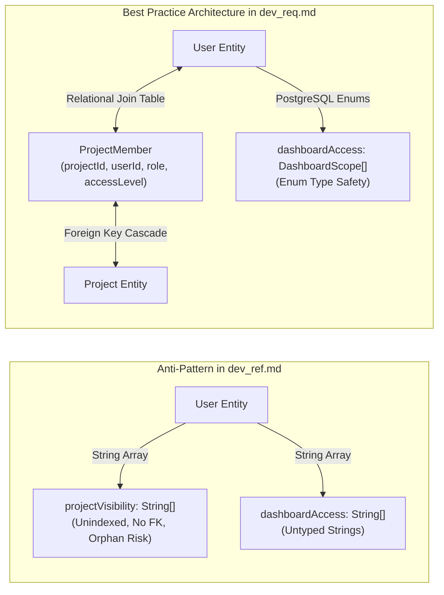
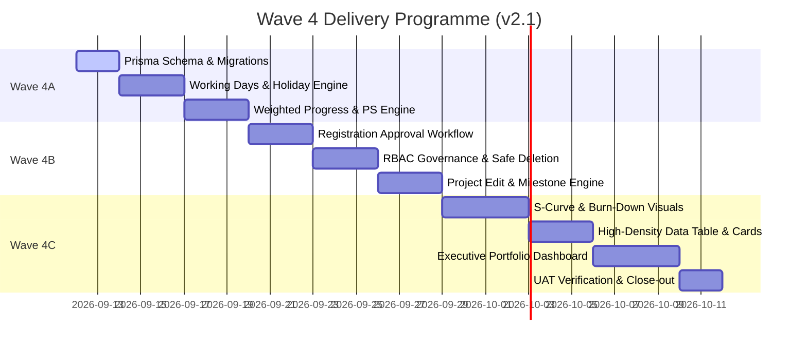

# Simple Project Task Tracker 2.1 — System Requirements & Technical Architecture Specification

**Document Identifier:** `doc/dev_req.md`  
**Product Title:** Simple Project Task Tracker 2.1 (Executive Portfolio Intelligence System)  
**Document Version:** 2.1.0-RC1  
**Status:** Approved Technical Requirements Specification  
**Language Standard:** Professional Australian English (`en-AU`)  
**Companion Documents:**
* [`./doc/dev_ref.md`](./dev_ref.md) — Raw Refinement Requirements Blueprint
* [`./doc/dev_plan.md`](./dev_plan.md) — Baseline Product Master Plan
* [`./doc/dev_spec.md`](./dev_spec.md) — Technical Specification (Wave 3 Baseline)
* [`./doc/dev_proc.md`](./dev_proc.md) — Historical Engineering Journal & Execution Log
* [`./doc/supabase-security.md`](./supabase-security.md) — RLS & Security Policy Baseline

**Authoring & Review Guild:**
* **Principal Business Analyst:** Requirements Elicitation, Scope Definition, and PMBOK Alignment
* **Chief Solution Architect:** System Architecture, Relational Integrity, and Mathematical Modelling
* **Technical Lead:** Next.js 16 / React 19 / Prisma 7 Implementation Standards & Best Practices
* **Senior Project Manager:** Delivery Milestones, Governance, and UAT Verification Matrices

---

## 1. Executive Summary & Business Objective

### 1.1 Business Context & System Evolution
Simple Project Task Tracker began as a single-user, LocalStorage-backed prototype (v1.0) and matured into an enterprise-grade, cloud-backed multi-user collaborative platform (v2.0) featuring Kanban boards, MS Planner–style task detail drawers, interactive Gantt timelines, and project-level progress metrics.

Version 2.1 represents a quantum evolutionary leap. It transitions the product from an operational task management tool into an **Executive Portfolio Intelligence System**. In modern capital project delivery, leadership cannot rely on unweighted task counts or subjective completion percentages. Ten minor administrative tasks cannot mask a critical four-week infrastructure delay. 

### 1.2 Core Objectives of Release 2.1
1. **Mathematically Rigorous Weighted Progress Engine:** Eliminate simplistic arithmetic averaging. Project progress is determined dynamically by the working-day duration of individual tasks relative to the project portfolio, honouring statutory Australian public holidays and corporate shutdown periods.
2. **Punctuality Score Engine (PS Engine):** Replace lagging indicators with predictive, real-time schedule health monitoring. Uncapped target progress rates allow early detection of commencement slippage, active execution delays, and post-completion schedule variance.
3. **11-State Status Flag State Machine:** Provide clear, instant operational and executive situational awareness using standardised Australian English Project Management nomenclature and visual indicators.
4. **Multi-Project Executive Portfolio Dashboards:** Introduce macro-level visibility across three distinct organisational scopes: Project-level, Project Manager (PM) Portfolio, and Total Company Capital Investment.
5. **Visual Schedule Realisation (S-Curves & Burn-Downs):** Deliver industry-standard cumulative progress S-Curves and remaining effort burn-down visualisations.
6. **Executive Macro Gantt Chart:** Provide high-level three-tiered timeline bars (Initial, Updated, Actual) with integrated Milestone diamond nodes.
7. **Enterprise User Governance & Relational Integrity:** Enforce a two-stage registration approval workflow, granular dashboard access delegation, and strict safe-deletion protocols preventing database orphaned references.

---

## 2. Stakeholder & Persona Analysis

| Persona | Organisational Role | Primary Objectives in v2.1 | Pain Points Addressed |
| :--- | :--- | :--- | :--- |
| **Super PM** *(Platform Admin & Portfolio Director)* | Chief Operating Officer / Head of PMO / Portfolio Director | Needs macro oversight across all company initiatives, authority to approve new personnel, power to reassign abandoned projects, and governance over national holiday calendars. | Lack of portfolio-wide aggregation; uncontrolled self-registration; cascading data loss when personnel depart. |
| **Project Manager (PM)** *(Project Controller & Delivery Lead)* | Delivery Lead / Senior PM / Scrum Master | Needs to control project memberships, set official Milestones, monitor realistic S-Curve deviations, identify at-risk tasks via Punctuality Scores, and present executive summaries to sponsors. | Inability to edit project metadata or members; lack of milestone tracking; distorted progress caused by unweighted task counts. |
| **Team Member** *(Task Realiser & Specialist Contributor)* | Engineer / Designer / Business Analyst / Contractor | Needs high-density data views for rapid inline task updates, transparent visibility of their workload and due dates, and zero friction in daily progress reporting. | Cluttered landing pages with irrelevant projects; slow multi-step drawer editing for quick status adjustments. |
| **Viewer** *(Stakeholder & Executive Sponsor)* | Executive Sponsor / Client / External Auditor | Needs clear, high-level read-only visibility into macro schedules, milestones, and punctuality flags without the risk of accidental mutations. | Unclear project health status; fear of unauthorised data tampering. |
| **Candidate User** *(Unapproved Registrant)* | Newly onboarded employee or external vendor | Needs seamless registration and transparent communication regarding their pending account approval state. | Ambiguous login states or silent authentication rejections. |

---

## 3. Mathematical Foundations & Calculation Engines

### 3.1 Working Days & Global Holiday Engine
All scheduling and duration calculations within Version 2.1 operate strictly upon **Business Working Days**, defined as Monday through Friday, excluding registered corporate shutdowns and statutory holidays.

#### Mathematical Definition:
Let calendar days be represented by integers $t \in \mathbb{Z}$. A calendar day $t$ is an active working day ($\operatorname{IsWorkDay}(t) = 1$) if and only if:
$$\operatorname{IsWorkDay}(t) = \begin{cases} 
0 & \text{if } \operatorname{DayOfWeek}(t) \in \{\text{Saturday}, \text{Sunday}\} \\
0 & \text{if } t \in \mathcal{H} \\
1 & \text{otherwise}
\end{cases}$$
where $\mathcal{H}$ represents the set of all calendar dates recorded in the `Holiday` repository.

#### Planned Duration Formulation:
For any task $i$ with `updatedStartDate` ($T_{\text{start}_i}$) and `updatedDueDate` ($T_{\text{due}_i}$):
$$D_{\text{planned}_i} = \max\left(1, \sum_{t = T_{\text{start}_i}}^{T_{\text{due}_i}} \operatorname{IsWorkDay}(t)\right)$$

> [!IMPORTANT]
> **Architectural Guardrail (Minimum Duration Rule):**  
> If $T_{\text{start}_i} = T_{\text{due}_i}$ on a working day, $D_{\text{planned}_i} = 1$. If a task spans entirely across a non-working period (e.g. over a weekend or public holiday), the planned duration is clamped to a minimum of **1 working day** to prevent zero-division errors in downstream weighting formulas. If dates are inverted ($T_{\text{start}_i} > T_{\text{due}_i}$), the engine automatically clamps $T_{\text{due}_i} = T_{\text{start}_i}$.

---

### 3.2 Relative Task Weight Engine ($W_i$)

To achieve true schedule reality, tasks requiring longer working-day commitments exert proportionally greater influence over the project's aggregate completion.

#### Relative Task Weight Formula:
$$W_i = \frac{D_{\text{planned}_i}}{\sum_{k=1}^{n} D_{\text{planned}_k}}$$
Where:
* $n$ is the total count of tasks in the project.
* $D_{\text{planned}_i}$ is the working-day duration of task $i$.
* $\sum_{k=1}^{n} D_{\text{planned}_k}$ is the aggregate working-day duration of the project.

#### Symmetrical Normalisation:
The sum of all relative task weights within a project strictly equals unity ($100\%$):
$$\sum_{i=1}^{n} W_i = 1.0 \quad (100.0\%)$$

> [!NOTE]
> **Edge Case Formulation (Zero-Task & Unscheduled Projects):**  
> If a project contains zero tasks, or if all tasks possess unassigned dates, $W_i$ defaults to $1/n$ (uniform distribution), ensuring mathematical stability.

---

### 3.3 Symmetrical Progress Aggregation Engine

Progress is calculated symmetrically at both the task micro-level and the project macro-level.

#### Task-Level Progress Metrics ($i$):
* **Weighted Target Progress:**
  $$\text{WeightedTarget}_i = P_{\text{target}_i} \times W_i$$
* **Weighted Actual Progress:**
  $$\text{WeightedActual}_i = P_{\text{actual}_i} \times W_i$$

#### Project-Level Progress Metrics (Linear Direct Sum):
Project progress is calculated via the direct linear summation of weighted task values, guaranteeing zero secondary re-weighting distortion:
$$P_{\text{actual}_{\text{project}}} = \sum_{i=1}^{n} \left( P_{\text{actual}_i} \times W_i \right) = \sum_{i=1}^{n} \text{WeightedActual}_i$$
$$P_{\text{target}_{\text{project}}} = \sum_{i=1}^{n} \left( P_{\text{target}_i} \times W_i \right) = \sum_{i=1}^{n} \text{WeightedTarget}_i$$

Both $P_{\text{actual}_{\text{project}}}$ and $P_{\text{target}_{\text{project}}}$ are reported to one decimal place in the user interface (e.g. `68.4%`).

---

### 3.4 Punctuality Score (PS) Engine & Uncapped Target Rates

Traditional project management tools cap target progress at $100\%$ on the due date. This conceals ongoing project slippage. Version 2.1 implements an **uncapped target progress rate** ($P_{\text{target}}$) that continues to accumulate linearly for every overdue working day.

#### Elapsed Working Days ($E_{\text{elapsed}}$):
Let $T_{\text{now}}$ be the current local calendar date (`YYYY-MM-DD`).
$$E_{\text{elapsed}_i} = \begin{cases}
0 & \text{if } T_{\text{now}} < T_{\text{start}_i} \\
\sum_{t = T_{\text{start}_i}}^{T_{\text{now}}} \operatorname{IsWorkDay}(t) & \text{if } T_{\text{now}} \ge T_{\text{start}_i}
\end{cases}$$

#### Uncapped Target Progress Rate ($P_{\text{target}}$):
$$P_{\text{target}_i} = \frac{E_{\text{elapsed}_i}}{D_{\text{planned}_i}}$$

*(Note: When $T_{\text{now}} > T_{\text{due}_i}$, $E_{\text{elapsed}_i} > D_{\text{planned}_i}$, resulting in $P_{\text{target}_i} > 100\%$. For example, a 10-day task that is 5 working days overdue has $P_{\text{target}} = 150\%$.)*

---

### 3.5 Piecewise Formulation of the Punctuality Score (PS)

The Punctuality Score measures execution efficiency against timeline commitments.

#### 1. Incomplete Tasks ($P_{\text{actual}} < 100\%$):
* **State 1A: Not Started ($P_{\text{actual}} = 0\%$):**
  $$\text{PS}_i = \begin{cases}
  100.0\% & \text{if } T_{\text{now}} < T_{\text{start}_i} \\
  \max\left(0.0\%, \left(1.0 - P_{\text{target}_i}\right) \times 100\%\right) & \text{if } T_{\text{now}} \ge T_{\text{start}_i}
  \end{cases}$$
* **State 1B: In Progress ($0\% < P_{\text{actual}} < 100\%$):**
  $$\text{PS}_i = \begin{cases}
  100.0\% + P_{\text{actual}_i} & \text{if } T_{\text{now}} < T_{\text{start}_i} \quad \text{(Early execution)} \\
  \frac{P_{\text{actual}_i}}{P_{\text{target}_i}} \times 100\% & \text{if } T_{\text{now}} \ge T_{\text{start}_i} \text{ and } P_{\text{target}_i} > 0 \\
  100.0\% & \text{if } T_{\text{now}} \ge T_{\text{start}_i} \text{ and } P_{\text{target}_i} = 0 \text{ (Commencement Day)}
  \end{cases}$$

#### 2. Completed Tasks ($P_{\text{actual}} = 100\%$):
For completed tasks, punctuality evaluates actual working duration against planned commitment:
$$\text{PS}_i = \frac{D_{\text{planned}_i}}{D_{\text{actual}_i}} \times 100\%$$
Where:
$$D_{\text{actual}_i} = \max\left(1, \sum_{t = T_{\text{actualStart}_i}}^{T_{\text{actualCompletion}_i}} \operatorname{IsWorkDay}(t)\right)$$

*(If actual dates are unrecorded upon completion, $T_{\text{actualStart}_i}$ defaults to $T_{\text{start}_i}$ and $T_{\text{actualCompletion}_i}$ defaults to the completion timestamp's local calendar date).*

#### 3. Project-Level Aggregate Punctuality Score:
$$\text{Project PS} = \begin{cases}
100.0\% & \text{if } P_{\text{target}_{\text{project}}} = 0 \text{ and } P_{\text{actual}_{\text{project}}} = 0 \\
100.0\% + P_{\text{actual}_{\text{project}}} & \text{if } P_{\text{target}_{\text{project}}} = 0 \text{ and } P_{\text{actual}_{\text{project}}} > 0 \\
\frac{P_{\text{actual}_{\text{project}}}}{P_{\text{target}_{\text{project}}}} \times 100\% & \text{if } P_{\text{target}_{\text{project}}} > 0
\end{cases}$$

---

### 3.6 Matrix of 11 Status Flags (Australian English PM Standard)

Every task and project is classified into exactly one of eleven deterministic states based on its lifecycle state, PS benchmark, and temporal relationship with $T_{\text{start}}$.

| Flag ID | Status Flag Nomenclature | PS Range | Lifecycle State & Temporal Criteria | Alert Level | Semantic Visual Tokens (Tailwind) |
| :--- | :--- | :--- | :--- | :--- | :--- |
| **SF-01** | **Due to Commence** | $\text{PS} = 100\%$ | $P_{\text{actual}} = 0\% \;\land\; T_{\text{now}} < T_{\text{start}}$ | Informational | Sky blue badge (`bg-sky-500/10 text-sky-400 border-sky-500/30`) |
| **SF-02** | **Delayed Commencement** | $85\% \le \text{PS} \le 100\%$ | $P_{\text{actual}} = 0\% \;\land\; T_{\text{now}} \ge T_{\text{start}}$ | Warning (Amber) | Amber badge (`bg-amber-500/10 text-amber-400 border-amber-500/30`) |
| **SF-03** | **Critically Overdue Start** | $\text{PS} < 85\%$ | $P_{\text{actual}} = 0\% \;\land\; T_{\text{now}} \ge T_{\text{start}}$ | Critical (Red) | Rose/Red badge (`bg-rose-500/10 text-rose-400 border-rose-500/30`) |
| **SF-04** | **On Track** | $95\% \le \text{PS} < 105\%$ | $0\% < P_{\text{actual}} < 100\%$ | Healthy (Green) | Emerald badge (`bg-emerald-500/10 text-emerald-400 border-emerald-500/30`) |
| **SF-05** | **Slipping** | $85\% \le \text{PS} < 95\%$ | $0\% < P_{\text{actual}} < 100\%$ | Warning (Amber) | Amber badge (`bg-amber-500/10 text-amber-400 border-amber-500/30`) |
| **SF-06** | **Critically Delayed** | $\text{PS} < 85\%$ | $0\% < P_{\text{actual}} < 100\%$ | Critical (Red) | Rose/Red badge (`bg-rose-500/10 text-rose-400 border-rose-500/30`) |
| **SF-07** | **Ahead of Schedule** | $\text{PS} \ge 105\%$ | $0\% < P_{\text{actual}} < 100\%$ | Positive (Teal) | Teal badge (`bg-teal-500/10 text-teal-400 border-teal-500/30`) |
| **SF-08** | **Completed Ahead of Schedule** | $\text{PS} \ge 105\%$ | $P_{\text{actual}} = 100\%$ | Completed (Blue) | Indigo badge (`bg-indigo-500/10 text-indigo-400 border-indigo-500/30`) |
| **SF-09** | **Completed On Time** | $95\% \le \text{PS} < 105\%$ | $P_{\text{actual}} = 100\%$ | Completed (Zinc) | Zinc/Muted badge (`bg-zinc-500/10 text-zinc-300 border-zinc-500/30`) |
| **SF-10** | **Completed Late** | $85\% \le \text{PS} < 95\%$ | $P_{\text{actual}} = 100\%$ | Overdue (Amber) | Amber-zinc badge (`bg-amber-950/30 text-amber-300 border-amber-700/50`) |
| **SF-11** | **Completed Severely Late** | $\text{PS} < 85\%$ | $P_{\text{actual}} = 100\%$ | Severe (Red) | Rose-zinc badge (`bg-rose-950/30 text-rose-300 border-rose-700/50`) |

> [!TIP]
> **Resolution of Edge Discontinuity (Delayed Commencement vs SF-01):**  
> In the raw draft, tasks on the exact commencement day ($T_{\text{now}} = T_{\text{start}}$) with $P_{\text{actual}} = 0\%$ had $\text{PS} = 100\%$, which created an ambiguity with SF-01. As specified above, $T_{\text{now}} < T_{\text{start}}$ exclusively receives **Due to Commence**. Once $T_{\text{now}} \ge T_{\text{start}}$ without commencement, the task immediately drops into **Delayed Commencement** ($85\% \le \text{PS} \le 100\%$), transitioning to **Critically Overdue Start** once $\text{PS} < 85\%$.

---

## 4. Functional Requirements Specification

### Module A: Global Holiday Calendar Management (FR-HOL)

* **FR-HOL-01 [Super PM Authority]:** The system shall provide a dedicated Global Holiday Calendar interface accessible exclusively to users with the `super_pm` role under `/settings/holidays`.
* **FR-HOL-02 [Holiday Entity Attributes]:** Each holiday record shall capture:
  * `date`: Calendar date (`@db.Date`, unique).
  * `description`: Descriptive name (e.g. "Australia Day", "Easter Monday", "End of Year Shutdown").
  * `isNational`: Boolean distinguishing official gazetted public holidays from internal corporate shutdowns.
  * Audit fields: `createdAt`, `createdBy`, `updatedAt`, `updatedBy`.
* **FR-HOL-03 [Dynamic Recalculation Trigger]:** When a holiday is created, modified, or deleted, all dependent task durations, task weights, target progresses, and project metrics shall be re-evaluated on subsequent reads or background cache updates without data corruption.

---

### Module B: User Registration, Approval & Advanced RBAC Governance (FR-GOV)

* **FR-GOV-01 [Registration Approval Lifecycle]:**
  * New user registrations shall default to `approvalStatus = PENDING`.
  * After verifying their email via Supabase Auth, a pending user cannot access projects, tasks, or analytical dashboards.
* **FR-GOV-02 [Pending Approval Routing]:**
  * The Next.js middleware shall detect authenticated users where `approvalStatus !== APPROVED`.
  * The user shall be redirected to a dedicated `/pending-approval` route with an explanatory notice: *"Your registration has been submitted and is currently awaiting approval from a Super PM."*
  * The `/pending-approval` view shall provide a functional Sign Out button allowing session termination.
* **FR-GOV-03 [Super PM Approval Console]:**
  * Super PMs shall have a dedicated management interface at `/settings/users` displaying all user accounts grouped by approval status (`PENDING`, `APPROVED`, `REJECTED`).
  * Super PMs can approve or reject accounts with a single action, recording `approvedAt` and `approvedBy`.
* **FR-GOV-04 [Dynamic Dashboard Scopes]:**
  * By default, PMs and Members have access to all dashboards; Viewers have none.
  * A Super PM can override dashboard privileges on a per-user basis across three granular scopes:
    1. `PROJECT`: Access to the Per-Project Analytics view.
    2. `PM_PORTFOLIO`: Access to the PM Portfolio Analytics dashboard.
    3. `TOTAL_COMPANY`: Access to the Macro Enterprise Portfolio dashboard.
* **FR-GOV-05 [Dynamic Project Membership & Management]:**
  * Super PMs possess unconditional read, write, and administrative rights across every project.
  * Super PMs can reassign the designated PM of any project to any approved user.
  * PMs possess administrative rights (`admin`) over projects they own, and read-only rights (`read`) over other projects where they are assigned as members.
  * Members possess edit rights (`write`) exclusively on projects where they are registered members (`ProjectMember`).
* **FR-GOV-06 [Safe Account Deletion & Asset Handover Wizard]:**
  * Direct cascade deletion of user accounts is strictly prohibited.
  * When a Super PM attempts to delete a user account, the system shall execute an integrity pre-check:
    1. Count of owned projects where `ownerId = targetUserId`.
    2. Count of active tasks where `assigneeId = targetUserId`.
  * If the target user owns projects or tasks, a **Safe Handover Modal** shall require the Super PM to select a replacement user from the approved roster.
  * All owned projects and tasks are reassigned in a single atomic database transaction prior to the removal of the user profile and authentication record.

---

### Module C: Project Management & Milestone Tracking (FR-PRJ & FR-MLS)

* **FR-PRJ-01 [Edit Project Interface]:**
  * Project Managers (for their owned projects) and Super PMs (for all projects) shall have access to an **Edit Project** modal.
  * Editable attributes include: Project Name, Description, and the Project Team Roster.
  * The interface shall provide a member selection multi-select search dropdown to dynamically add or remove `ProjectMember` records.
* **FR-MLS-01 [Milestone Entity Model]:**
  * Projects shall support discrete Milestones representing critical contractual checkpoints or stage gates.
  * Attributes: `id`, `projectId`, `name`, `description`, `initialTarget` (`@db.Date`), `updatedTarget` (`@db.Date`), `actualAchieved` (`@db.Date`, nullable), and complete audit fields.
* **FR-MLS-02 [Milestone Date Synchronisation]:**
  * Upon milestone creation, `updatedTarget` shall automatically mirror `initialTarget`.
  * PMs can revise `updatedTarget` independently to reflect schedule re-baselining.
  * When `actualAchieved` is populated, the milestone is visually marked as complete.
* **FR-MLS-03 [Milestone Timeline Rendering]:**
  * In the Per-Project Gantt Chart, milestones shall render as vertical dashed lines spanning across all task rows. The line is anchored to `actualAchieved` if completed, or `updatedTarget` if pending.
  * In the Executive Multi-Project Gantt Chart, milestones shall render as diamond nodes directly affixed to the project's macro bars.

---

### Module D: Landing Page & High-Density UI Refactoring (FR-UI)

* **FR-UI-01 [Role-Centric Smart Default Views]:**
  * Upon visiting `/`, the project directory shall filter automatically:
    * **Super PM / PM:** Defaults to the **My Own Projects** tab (projects where `ownerId = sessionUser.id`).
    * **Member:** Defaults to the **My Assigned Projects** tab (projects where `members.some(userId = sessionUser.id)`).
  * Quick filter toggles shall allow switching between: *My Own Projects*, *Projects by PM*, and *All Projects*.
* **FR-UI-02 [Enhanced Executive Project Cards]:**
  * Project cards on the landing page shall display:
    1. Project Name & Description snippet.
    2. Designated PM name with avatar initials.
    3. Status Flag pill badge adhering to the 11-State nomenclature and semantic colours.
    4. Symmetrical Progress Indicator: Dual compact progress bars showing $P_{\text{target}}$ (slate/zinc) vs. $P_{\text{actual}}$ (emerald/amber).
    5. Count of active tasks and overdue tasks.
* **FR-UI-03 [High-Density Tabular Task View]:**
  * Within the project workspace, the List View shall be upgraded to a High-Density Data Table.
  * Columns: Reorder Handle, Task Title, Process Group (Initiating → Closing), Priority, Weight ($W_i$), Multi-Dates (Initial, Updated, Actual), PIC/Assignee badge, Status, and Progress Slider/Input.
  * Inline cell editing shall be supported for Status, Priority, Progress, and PIC.

---

### Module E: Advanced Analytics Visualisations (FR-ANL)

* **FR-ANL-01 [Per-Project S-Curve Graph]:**
  * The Per-Project Analytics view shall incorporate a cumulative progress **S-Curve** chart powered by Recharts.
  * **X-Axis:** Calendar working timeline from the project's earliest start date to latest completion/due date.
  * **Y-Axis:** Cumulative Percentage ($0\%$ to $100\%$).
  * **Series 1 (Target S-Curve):** Cumulative $\sum W_i \times P_{\text{target}_i}(t)$ rendered as a dashed neutral line.
  * **Series 2 (Actual Realisation Curve):** Cumulative $\sum W_i \times P_{\text{actual}_i}(t)$ rendered as a solid emerald/amber line terminating at $T_{\text{now}}$.
* **FR-ANL-02 [Task Effort Burn-Down Chart]:**
  * Displays remaining working-day effort over time.
  * Compares the ideal linear burn-down trajectory against actual remaining task volume.
* **FR-ANL-03 [Executive Dashboard Header Integration]:**
  * The project analytics header shall clearly display the aggregate Punctuality Score ($\text{Project PS}$), the Target vs. Actual progress divergence ($\Delta = P_{\text{actual}} - P_{\text{target}}$), and the project's overall Status Flag.

---

### Module F: Multi-Project Executive Portfolio Dashboards (FR-PORT)

* **FR-PORT-01 [Dedicated Portfolio Route]:**
  * Executive portfolio analytics shall be housed under a dedicated top-level route: `/portfolio`.
  * Accessible exclusively to users holding `PM_PORTFOLIO` or `TOTAL_COMPANY` dashboard privileges.
* **FR-PORT-02 [Three Distinct Viewing Scopes]:**
  1. **Analytics by Project:** Deep comparison across selected individual projects.
  2. **Analytics by PM:** Aggregates all capital projects managed by a selected Project Manager, showcasing portfolio-level health, aggregate punctuality, and resource allocation.
  3. **Total Company Projects:** A macro portfolio overview of every active capital programme across the entire enterprise.
* **FR-PORT-03 [Executive Multi-Project Macro Gantt]:**
  * Positioned prominently at the top of the PM Portfolio and Total Company views.
  * **Three-Tier Project Bars:** Renders three clean, uncluttered horizontal timeline bars per project:
    1. *Initial Planned Span* (Zinc): Earliest `initialStartDate` to latest `initialDueDate`.
    2. *Updated Planned Span* (Sky Blue): Earliest `updatedStartDate` to latest `updatedDueDate`.
    3. *Actual Realisation Span* (Emerald / Amber): Earliest `actualStartDate` to latest `actualCompletionDate`. If the project remains active, the Actual bar terminates at the vertical "Today" line.
  * **Milestone Diamond Overlays:** Project milestones are pinned directly onto the macro bars as diamond markers.
  * **Instant Hover Tooltips (0ms):** Hovering over a milestone diamond reveals an instant popover displaying Milestone Name, Description, Target Date, Achieved Date, and Variance.

---

### Module G: System Administration & About Modal (FR-ADM)

* **FR-ADM-01 [Super PM Global Settings Console]:**
  * Restricted navigation menu `/settings` providing access to User Approvals, Privilege Overrides, Safe Deletion, and the Holiday Calendar.
* **FR-ADM-02 [System About & Architectural Credits Modal]:**
  * Accessible from the user profile dropdown.
  * Displays application release metadata (`v2.1.0-executive-intel`), runtime stack versions, database connectivity status, and formal architectural credits denoting **Yugo Ananda** as the Grand Designer and Chief Solution Architect.

---

## 5. Architectural Critique & Best Practice Recommendations

As part of the Technical Lead and Solution Architect evaluation, several proposed structures in the initial raw draft (`dev_ref.md`) represent architectural anti-patterns. The following engineering enhancements are formally adopted for Version 2.1:



### Recommendation 1: Eliminate `projectVisibility String[]` in Favour of Relational Join Tables
* **Identified Vulnerability:** `dev_ref.md` proposed storing an array of Project UUIDs (`projectVisibility String[]`) directly on the `User` model.
* **Technical Risk:** Storing foreign entity keys within a PostgreSQL array column violates First Normal Form (1NF). It prevents database foreign key constraints (`ON DELETE CASCADE`), risks dangling pointer errors when projects are deleted, and necessitates inefficient full-table scans using unindexed array search operators (`@>`).
* **Architectural Decision:** Retain and extend the canonical relational join table: **`ProjectMember`**. Explicit project visibility and custom permissions are managed as relational records linking `userId` to `projectId`. Super PM overrides are stored either via `ProjectMember` records or a dedicated `ProjectPermissionGrant` join table.

---

### Recommendation 2: Strong Typing for `dashboardAccess` via PostgreSQL Enums
* **Identified Vulnerability:** Storing raw strings in `dashboardAccess String[]` (e.g. `["PROJECT", "PM", "COMPANY"]`) allows typos and breaks runtime schema verification.
* **Architectural Decision:** Introduce a formal Prisma Enum:
  ```prisma
  enum DashboardScope {
    PROJECT
    PM_PORTFOLIO
    TOTAL_COMPANY
  }
  ```
  The `User` model will define `dashboardAccess DashboardScope[] @default([PROJECT, PM_PORTFOLIO])`, guaranteeing compile-time and database-level type safety.

---

### Recommendation 3: Division-by-Zero Defensive Guardrails
* **Identified Vulnerability:** The mathematical specifications for $W_i$, $P_{\text{target}}$, and Completed Task $\text{PS} = \frac{D_{\text{planned}}}{D_{\text{actual}}}$ could evaluate to division by zero if dates are identical or actual durations are zero days.
* **Architectural Decision:** Implement strict mathematical clamping functions in `src/lib/analytics/weighted-progress.ts`:
  1. $D_{\text{planned}} = \max(1, \text{WorkingDays}(T_{\text{start}}, T_{\text{due}}))$
  2. $D_{\text{actual}} = \max(1, \text{WorkingDays}(T_{\text{actualStart}}, T_{\text{actualEnd}}))$
  3. If $\sum D_{\text{planned}} = 0$ across a project, each task receives an equal weight of $1/n$.
  4. If $P_{\text{target}} = 0$, PS falls back to $100\%$ on commencement day.

---

### Recommendation 4: Session Middleware Integration for Account Approval
* **Identified Vulnerability:** Blocking unapproved users solely inside Server Actions causes broken UI states where pages render partially before throwing action errors.
* **Architectural Decision:** Enforce access control at the edge inside `src/middleware.ts`. When a user's session token is refreshed, the user's `approvalStatus` is queried. If `PENDING` or `REJECTED`, the request is redirected to `/pending-approval` immediately, preventing any unapproved page payload delivery.

---

### Recommendation 5: Audit Trail Architecture via Prisma Middleware / Server Action Helpers
* **Identified Vulnerability:** Manually supplying `createdBy` and `updatedBy` across every mutation invites developer omission and inconsistent auditing.
* **Architectural Decision:** Standardise an action wrapper `withAuditSession(actionFn)` that extracts the validated `sessionUser.id` and injects it into Prisma write payloads automatically.

---

## 6. Database Schema Specification (Prisma ORM)

Below is the complete, canonical schema extension for Version 2.1 to be placed in `prisma/schema.prisma`:

```prisma
// ===========================================================================
// Simple Project Task Tracker 2.1 — Prisma Schema Extensions
// ===========================================================================

generator client {
  provider = "prisma-client-js"
}

datasource db {
  provider = "postgresql"
}

// ---------------------------------------------------------------------------
// Enums
// ---------------------------------------------------------------------------

enum GlobalRole {
  super_pm
  pm
  member
  viewer
}

enum ApprovalStatus {
  PENDING
  APPROVED
  REJECTED
}

enum DashboardScope {
  PROJECT
  PM_PORTFOLIO
  TOTAL_COMPANY
}

enum TaskStatus {
  todo
  in_progress
  done
}

enum TaskPriority {
  urgent
  important
  medium
  low
}

enum TaskBucket {
  initiating
  planning
  executing
  monitoring
  closing
}

// ---------------------------------------------------------------------------
// Core Models with Full Audit Trails
// ---------------------------------------------------------------------------

model Holiday {
  id          String   @id @default(uuid()) @db.Uuid
  date        DateTime @unique @db.Date
  description String
  isNational  Boolean  @default(true)
  
  // Audit Trail
  createdAt   DateTime @default(now())
  createdBy   String?  @db.Uuid
  updatedAt   DateTime @updatedAt
  updatedBy   String?  @db.Uuid

  @@index([date])
}

model User {
  id              String           @id @db.Uuid
  email           String           @unique
  name            String
  globalRole      GlobalRole       @default(member)
  approvalStatus  ApprovalStatus   @default(PENDING)
  approvedAt      DateTime?
  approvedBy      String?          @db.Uuid
  dashboardAccess DashboardScope[] @default([PROJECT, PM_PORTFOLIO])
  
  // Audit Trail
  createdAt       DateTime         @default(now())
  updatedAt       DateTime         @updatedAt

  // Relationships
  ownedProjects   Project[]        @relation("ProjectOwner")
  projectMembers  ProjectMember[]
  assignedTasks   Task[]           @relation("TaskAssignee")
  comments        TaskComment[]

  @@index([email])
  @@index([approvalStatus])
}

model Project {
  id          String   @id @default(uuid()) @db.Uuid
  name        String
  description String   @default("")
  ownerId     String   @db.Uuid
  
  // Audit Trail
  createdAt   DateTime @default(now())
  createdBy   String?  @db.Uuid
  updatedAt   DateTime @updatedAt
  updatedBy   String?  @db.Uuid

  // Relationships
  owner       User            @relation("ProjectOwner", fields: [ownerId], references: [id])
  members     ProjectMember[]
  tasks       Task[]
  milestones  Milestone[]

  @@index([ownerId])
}

model ProjectMember {
  id        String   @id @default(uuid()) @db.Uuid
  projectId String   @db.Uuid
  userId    String   @db.Uuid
  canEdit   Boolean  @default(true)
  
  // Audit Trail
  createdAt DateTime @default(now())
  createdBy String?  @db.Uuid

  project   Project  @relation(fields: [projectId], references: [id], onDelete: Cascade)
  user      User     @relation(fields: [userId], references: [id], onDelete: Cascade)

  @@unique([projectId, userId])
  @@index([userId])
  @@index([projectId])
}

model Milestone {
  id             String    @id @default(uuid()) @db.Uuid
  projectId      String    @db.Uuid
  name           String
  description    String?   @default("")
  initialTarget  DateTime  @db.Date
  updatedTarget  DateTime  @db.Date
  actualAchieved DateTime? @db.Date

  // Audit Trail
  createdAt      DateTime  @default(now())
  createdBy      String?   @db.Uuid
  updatedAt      DateTime  @updatedAt
  updatedBy      String?   @db.Uuid

  project        Project   @relation(fields: [projectId], references: [id], onDelete: Cascade)

  @@index([projectId])
  @@index([updatedTarget])
}

model Task {
  id                   String       @id @default(uuid()) @db.Uuid
  projectId            String       @db.Uuid
  title                String
  description          String       @default("")
  status               TaskStatus   @default(todo)
  priority             TaskPriority @default(medium)
  bucket               TaskBucket   @default(executing)
  assigneeId           String?      @db.Uuid
  assigneeName         String       @default("")
  
  // Duration & Scheduling Multi-Dates
  initialStartDate     DateTime?    @db.Date
  initialDueDate       DateTime?    @db.Date
  updatedStartDate     DateTime?    @db.Date
  updatedDueDate       DateTime?    @db.Date
  actualStartDate      DateTime?    @db.Date
  actualCompletionDate DateTime?    @db.Date
  
  // Metric Engine Fields
  progress             Int          @default(0)
  sortOrder            Int          @default(0)
  weightOverride       Float?       // Optional effort multiplier (default 1.0)

  // Audit Trail
  createdAt            DateTime     @default(now())
  createdBy            String?      @db.Uuid
  updatedAt            DateTime     @updatedAt
  updatedBy            String?      @db.Uuid

  project              Project       @relation(fields: [projectId], references: [id], onDelete: Cascade)
  assignee             User?         @relation("TaskAssignee", fields: [assigneeId], references: [id], onDelete: SetNull)
  subtasks             Subtask[]
  comments             TaskComment[]

  @@index([projectId])
  @@index([projectId, status, sortOrder])
}

model Subtask {
  id          String   @id @default(uuid()) @db.Uuid
  taskId      String   @db.Uuid
  title       String
  isCompleted Boolean  @default(false)
  sortOrder   Int      @default(0)
  
  // Audit Trail
  createdAt   DateTime @default(now())
  createdBy   String?  @db.Uuid
  updatedAt   DateTime @updatedAt
  updatedBy   String?  @db.Uuid

  task        Task     @relation(fields: [taskId], references: [id], onDelete: Cascade)

  @@index([taskId])
}

model TaskComment {
  id        String   @id @default(uuid()) @db.Uuid
  taskId    String   @db.Uuid
  userId    String   @db.Uuid
  content   String
  
  // Audit Trail
  createdAt DateTime @default(now())
  createdBy String?  @db.Uuid

  task      Task     @relation(fields: [taskId], references: [id], onDelete: Cascade)
  user      User     @relation(fields: [userId], references: [id], onDelete: Cascade)

  @@index([taskId])
  @@index([userId])
}
```

---

## 7. Non-Functional Requirements (NFR)

### 7.1 Performance & Computational Latency
* **Engine Execution Speed:** S-Curve data points and task weight aggregations for projects containing up to 500 tasks shall execute in $< 50\text{ ms}$ on the server.
* **Zero Layout Shift:** Tab switching between List, Kanban, Gantt, and Analytics must occur smoothly without layout jitter or cascading React re-renders.

### 7.2 Security & Data Governance
* **Row-Level Security (RLS):** All newly created tables (`Holiday`, `Milestone`) shall have PostgreSQL RLS enabled. Server Actions connecting via Prisma shall maintain fail-closed authorisation checks.
* **Authentication Boundary:** Unapproved users cannot execute Server Actions. Any attempt to invoke actions from an unapproved session throws an immediate `ActionError("Account pending approval", "FORBIDDEN")`.

### 7.3 Localisation & Ergonomics
* **Locale:** Australian English (`en-AU`).
* **Date Representation:** Form displays and tooltips must render calendar dates in `DD/MM/YYYY` format using `date-fns/format`.
* **Spelling:** All user-facing interface text, error messages, and documentation must adhere strictly to Australian spelling (e.g. *programme*, *prioritise*, *visualisation*, *colour*).

### 7.4 Accessibility (WCAG 2.1 AA Compliance)
* All status badges must pair colour coding with distinct text labels or semantic icons to ensure readability for colour-blind users.
* High-density data tables must support full keyboard navigation and meet ARIA combobox / data grid specifications.

---

## 8. Phased Implementation Roadmap (Wave 4 Strategy)

Delivery of Version 2.1 is structured into three coordinated execution waves under the Wave 4 milestone series:



### Wave 4A: Core Calculation Engines & Data Layer
1. Apply Prisma migration for `Holiday`, `Milestone`, `ApprovalStatus`, `DashboardScope`, and audit fields.
2. Build `src/lib/analytics/working-days.ts` with Australian holiday exclusion and calendar math.
3. Build `src/lib/analytics/weighted-progress.ts` delivering $W_i$, $P_{\text{target}}$, $\text{PS}$, and the 11-State Status Flag matrix.
4. Implement unit tests verifying all mathematical formulas, boundary conditions, and division-by-zero protections.

### Wave 4B: Governance, User Management & Milestones
1. Scaffold the Super PM Global Holiday Management UI (`/settings/holidays`).
2. Implement the User Registration Approval Queue (`/settings/users`) and `/pending-approval` route.
3. Wire middleware session guards to redirect unapproved accounts.
4. Implement the Safe Account Deletion handover wizard.
5. Deliver the Project Settings modal and Milestone management engine.

### Wave 4C: Advanced Visualisations & Portfolio Dashboards
1. Build the High-Density Data Table with inline editing for the project workspace.
2. Upgrade project landing cards with target vs. actual visual progress bars and status badges.
3. Build the Per-Project S-Curve and Burn-Down charts in `ProjectAnalyticsView.tsx`.
4. Implement the Executive Multi-Project Portfolio Dashboard (`/portfolio`) with the three viewing scopes and the Macro Executive Gantt Chart.
5. Embed the System About & Architectural Credits modal.
6. Execute the complete User Acceptance Testing (UAT) protocol.

---

## 9. User Acceptance Testing (UAT) Verification Matrix

| Test ID | Feature Area | Scenario & Execution Steps | Expected Outcome |
| :--- | :--- | :--- | :--- |
| **UAT-401** | Holiday Engine | Define a national holiday on Tuesday; create a task running Mon–Wed. | Duration evaluates to 2 working days (not 3); weekend days excluded. |
| **UAT-402** | Weighted Progress | Project with Task A (10 days) and Task B (2 days). | Task A weight evaluates to $83.3\%$; Task B evaluates to $16.7\%$. |
| **UAT-403** | Punctuality Score | Task A is 5 days overdue with $P_{\text{actual}} = 50\%$. | $P_{\text{target}} = 150\%$; $\text{PS} = 33.3\%$; Status Flag evaluates to **Critically Delayed**. |
| **UAT-404** | Status Flag SF-01 | Task due to start next week with $P_{\text{actual}} = 0\%$. | Status Flag displays **Due to Commence** with Sky Blue badge. |
| **UAT-405** | Approval Queue | Register new user `candidate@test.com`. Sign in. | User is redirected to `/pending-approval`; blocked from `/projects`. |
| **UAT-406** | Safe Deletion | Super PM attempts to delete PM owning 2 projects. | System blocks immediate deletion; prompts handover modal; successfully transfers projects. |
| **UAT-407** | Milestone Sync | Create Milestone with Target `15/10/2026`. | `updatedTarget` mirrors `initialTarget`; renders vertical marker on Gantt. |
| **UAT-408** | S-Curve Realisation | View project analytics after marking 3 tasks complete ahead of time. | Actual green line trends above the dashed target curve. |
| **UAT-409** | Executive Gantt | Open `/portfolio` as Super PM under *Total Company*. | Macro Gantt renders 3 clean bars per project with milestone diamond nodes and instant tooltips. |
| **UAT-410** | Credits Modal | Open About modal from user dropdown. | Version displays `v2.1.0-executive-intel`; Yugo Ananda credited as Grand Designer. |

---

*End of System Requirements Specification (`doc/dev_req.md`). Approved for engineering execution under Release 2.1.*
